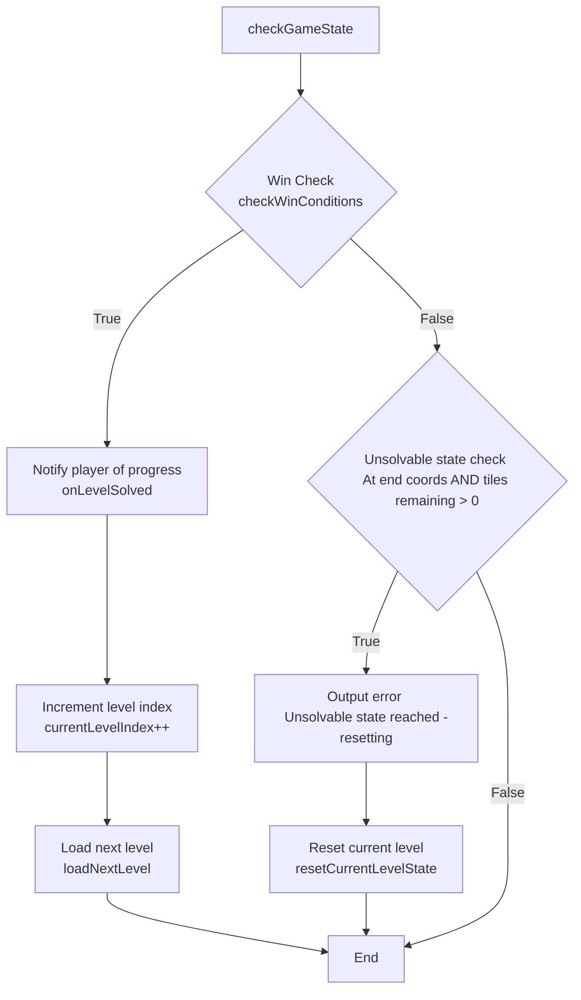

# COMP3016 CW1

Immersive Game Technologies

> This is an individual assignment to develop a 2D game in C++. <br>
> Implement a 2D game in C++ and upload to your git repository, then share the link in the readme. Your game needs to adhere to OOP concepts and additionally be able to load file content during execution. Do enough documented testing that it can be built and compile, and that it doesn’t crash upon unexpected input. Lastly, add in as many features as you can to make it story rich and/or fun!

[](https://wakatime.com/@coreyrichardson/projects/psorloapdb?start=2025-10-13&end=2025-11-03)

| YouTube Game Demonstration and Code Walkthrough Link |
| :---: |
| https://youtu.be/Izb39A_jcA0?si=dNG4okZAVmT7cioN |

To run the `.exe`, first ensure that the `levels/` directory is present. If building from Visual Studio, this directory should be placed alongside the source code and is copied over by a Post-Build Event. If using a non-Windows machine, the CLI command used to do this may need to be altered for your platform.

---

## Contents

1. [Gameplay Description](#gameplay-description)  
2. [Dependencies Used](#dependencies-used)  
3. [Use of AI Description](#use-of-ai-description)  
4. [Game Programming Patterns Used](#game-programming-patterns-used)  
5. [Game Mechanics and How They Are Coded](#game-mechanics-and-how-they-are-coded)  
6. [UML Design Diagrams](#uml-design-diagrams)  
7. [Sample Screens](#sample-screens)  
8. [Exception Handling and Test Cases](#exception-handling-and-test-cases)  
9. [Further Details](#further-details)
10. [Known Bugs](#known-bugs)
11. [Project Evaluation](#project-evaluation)

## Gameplay Description

"Puzzle Path Game" is a tile based puzzle game where the player must use logic and reasoning skills to navigate a grid, visiting every walkable tile on their way.

The objective of the same is to move from the Start `S` tile to the End `E` tile, visiting every walkable tile on their route. If the user reaches the End `E` tile without first visiting every walkable tile, the level is considered to be in an unsolvable condition and the level is reset to it's initial state.

The game is inspired by B-Cubed on CoolMathsGames, an educational games platform. The game develops skills in younger players including logic, spatial reasoning and forward planning. The design of the game encourages players to reason through sequences and visualise the route in their minds before making a move.

The game features two main walkable tile types: Walkable `#` and Multi-Visit `2`, `1`. Whereas Walkable tiles may only be visited once, Multi-Visit tiles mist be visited multiple times before they are considered 'visited' by the game engine. This adds a layer of complexity and depth to the planning, where a tile will need to be revisited again later in the solution sequence. This complexity is introduced gradually in the Standard mode of the game, forcing the player to problem-solve and reason to understand the new mechanism.

There are two modes for gameplay, selectable in the Main Menu screen of the game.

Standard:
- Levels are played in a set sequential order as listed in the [level manifest file](./app/levels/level-manifest.txt), introducing complexity gradually.

Endless Random Mode:
- Levels are randomly shuffled each play-through cycle allowing for infinite replayability, with a running counter to track the progres of total levels completed across cycles.

## Dependencies Used

The project uses standard C++ libraries:
- `iostream`, `string`, `vector` Core utility.
- `fstream` File I/O for runtime level loading handling.
- `random`, `chrono`, `algorithm` Used by the `RandomGame` class to `std::shuffle` the level sequences, a time-based seed is used for randomisation.
- `memory` Used by `std::unique_ptr` to handle resource management for polymorphic `Game` and `RandomGame` objects, and dynamic safe memory allocation for `Grid` and `PlayerCursor` objects.

The game also depends on level files being present in `.txt` format in a `levels/` directory alongside the program's executable file at runtime. 

These files are copied using a Post-Build Event from `./app/levels/` to the output directory at build-time: `Debug/` or `Release/`.

`app` > `Properties` > `Build Events` > `Post-Build Event` > `Command Line`:

```sh
xcopy "$(ProjectDir)levels" "$(TargetDir)levels\" /s /i /y
```

> This command may be required to be changed if building the project on a non-Windows machine.

## Use of AI Description

> In line with the indicated acceptable level of AI use above, the following uses are acceptable:
> - Creating game assets (models, sprites, font and title, art, music and sound effects).
> - Code assistant.
> - Programming testing.
> - Readme report crafting.

### Code Assistant

An AI model was used to assist with refactoring methods throughout the development process. This helped me ensure that my class designs were memory safe and adhered to Software Engineering principles (OOP/SOLID/DRY/RAII).

The AI model provided me with guidance on how to use `std::unique_ptr`s to ensure memory safety through the Resource Acquisition Is Initialisation (RAII) design pattern; `Game` *owns* `Grid` and `PlayerCursor` objects, therefore handling automatic memory cleanup when the object is destroyed.

AI was also used to assist with code-documentation, assisting with generating accurate Doxygen comments (`@brief`, `@param`, `@return`, `@throws`). These comments help to ensure that the codebase is maintainable.

GitHub Copilot has also been used to draft some of the commit messages for this project, ensuring commit messages were clearly and concisely describing the changes made using the correct technical termionology. Commit messages were reviewed by me and changed where needed to ensure they were accurate to the changes made and not off-topic. This ensures that the version-control history of the project remained accurate, provided a documentation of changes made as the project developed.

*AI models were used only in an assistive role, and where used I ensured that I understood the changes it was suggesting and implemented them myself.*

### Programming Testing

AI was also used to find and debug issues within the code.

This was especially the case when attempting to resolve [Known Bugs: \[1\]](#known-bugs), where the recursive `Game::loadNextLevel` method required a base case limiting the number of attempts in order to remove the risk of an infinitely recursing self-call.

### README Report Crafting

AI has been used to assist with technical documentation, helping me ensure that the reports details are correct! It helped me whilst writing about the implementation of Software Engineering principles used throughout the project, as well as helping me to describe why these design choices were made.

## Game Programming Patterns Used

The system was developed using Object-Oriented Programming (OOP) principles, SOLID Software Engineering Design guidelines and Game Programming Patterns in mind, ensuring easy extensibility and maintainability for the project.

The project relies on polymorphism to decouple game logic from specific tile and game mode implementations, instead promoting extensibility and ahering to the Liskov Substituion Principle (LSP).

> "The Liskov substitution principle (LSP) states that functions that use pointers or references to base classes must be able to use objects of derived classes without knowing it."

This principle is in the Game Mode strategy and the Tile behaviour strategy.

### Gane Mode Strategy

The `runGameFlow()` function is used to run a game instance and provide error handling and reporting. It takes a parameter `std::unqiue_ptr<Game> gameInstance` to handle either the standard `Game` *or* the `RandomGame` object being passed in.

The game loop only ever calls the base class `Game::run(manifest)` method, but runtime behaviour of the game - whether using the Standard sequential loop, or the random endless shuffling - is determined by the extensions from the concrete derived class.

### Tile Behaviour Strategy

The `Tile` base class is publicly inherited from by the `StandardTile` and `MultiVisitTile` classes, with the derived classes extending or speciailising the functionality of the base classes methods.

The `Grid` class applies polymorphism by storing pointers to the base `Tile` class.

The `Tile` base class defines several `virtual` methods. `isWalkable()` and `updateStateOnExit()` are declared as pure virtual methods, forcing the derived classes to provide an implementation of their own for these methods.

```cpp
/**
* @brief Determine whether the Tile can be moved to.
* Overrides the pure virtual method Tile::isWalkable.
* @return True if the Tile permits movement, else false
*/
bool StandardTile::isWalkable() const {
	return (
		this->type == TileType::Walkable ||
		this->type == TileType::Start ||
		this->type == TileType::End
	);
}


/**
* @brief Determine whether the Tile can be moved to.
* Overrides the pure virtual method Tile::isWalkable.
* @return True if the Tile has remaining visits, else false
*/
bool MultiVisitTile::isWalkable() const {
	return this->remainingVisits > 0;
}
```

```cpp
/**
* @brief Update the Tile state when the player leaves it.
* Overrides the pure virtual method Tile::updateStateOnExit.
* @return True if the update succeeded, else false
*/
bool StandardTile::updateStateOnExit() {
	if (this->type == TileType::Walkable) {
		this->type = TileType::Visited;
		return true;
	}
	return false;
}


/**
* @brief Update the Tile state when the player leaves it.
* Overrides the pure virtual method Tile::updateStateOnExit.
* Decrements the number of remaining visits for the Tile if gt zero.
* @return True if the update succeeded (remainingVisits decremented), else false
*/
bool MultiVisitTile::updateStateOnExit() {
	if (this->remainingVisits > 0) {
		this->remainingVisits--;
		return true;
	}
	return false;
}
```

The `StandardTile` class uses the base `Tile::tileTypeToChar()` definition to handle conversion between the `TileType` enum and the display character outputted to the player's screen: `#`, `S`, `E`, `*`.

```cpp
// Tile.cpp

/** 
* @brief Converts a TileType value to its corresponding display character
* @return type The TileType object that is to be converted to a display character
* @params A character representing the given TileType
*/
char Tile::tileTypeToChar(TileType type) const {
	switch (type) {
		case TileType::Void:
			return ' ';
		case TileType::Walkable:
			return '#';
		case TileType::Start:
			return 'S';
		case TileType::End:
			return 'E';
		case TileType::Visited:
			return '*';
		case TileType::Invalid:
		default:
			return '?';
	}
}
```

This differs from the `MultiVisitTile` class which overrides this method to inject it's specialised logic and requirements based on it's own member variable states.

```cpp
// MultiVisitTile.cpp

/**
* @brief Converts a TileType value to its corresponding display character
* * Overrides the method Tile::tileTypeToChar.
* @return type The TileType object that is to be converted to a display character; should be TileType::MultiVisit
* @params A character representing the given TileType, depending on remainingVisits
*/
char MultiVisitTile::tileTypeToChar(TileType type) const {
	switch (this->remainingVisits) {
		case (2):
			return '2';
		case (1):
			return '1';
		case (0):
			return '*';
		default:
			return '+';
	}
}
```

### Template Method Pattern

The [Template Method Pattern](https://en.wikipedia.org/wiki/Template_method_pattern) ensures both game objects have a consistent lifecycle, whilst still allowing the derived class `RandomGame` to inject specialised functionality into the `Game` class, adhering to the Open/Closed Principle (OCP).

`Game::checkGameState()` provides a template that defines the required sequence of actions after a move is made by the user:

```cpp
/**
* @brief Checks the current game state and reacts to level completion or 
* unsolvable states
*/
void Game::checkGameState() {
	if (grid->checkWinConditions(player->getCurrentPosition())) {
		onLevelSolved();
		this->currentLevelIndex++;
		loadNextLevel();
		return;
	}

	if (player->getCurrentPosition() == grid->getEndCoords() &&
		grid->getRemainingWalkableTiles() > 0) {
		std::cerr << "Unsolvable state reached! Resetting..." << std::endl;
		this->resetCurrentLevelState();
	}
}
```



The `virtual` method `Game::onLevelSolved()` acts as a hook, allowing the `RandomGame` class to inject logic. The base implementation prints a standard "Level Solved!" message to the player. The `RandomGame` class overrides the hook to implement its specialised logic: it increments the `totalLevelsCompleted` counter variable and outputs the "Level Solved!" message alongside a message informing the user on how many levels they have completed in this play of the Random Endless Mode.

```cpp
// Game.cpp

/**
* @brief Default hook method that prints a message when a level has been successfully solved.
*/
void Game::onLevelSolved() {
	std::cout << "\nLevel " << this->currentLevelIndex + 1 << " solved!\n" << std::endl;
}
```

```cpp
/**
* @brief Overriden method that increments total levels completed counter and
* outputs number of levels solved.
*/
void RandomGame::onLevelSolved() {
	this->levelsCompleted++;

	std::cout << "\nLevel " << this->currentLevelIndex + 1 << " solved!" << std::endl;
	std::cout << "(Total Completed: " << this->levelsCompleted << ")\n" << std::endl;
}
```

This injection extends the functionality without requiring any modification to handle conditional flows within the `Game::checkGameState()` method.

### Resource Acquisition Is Initialisation (RAII) Pattern

The project uses the [Resource Acquisition Is Initialisation](https://en.wikipedia.org/wiki/Resource_acquisition_is_initialization) Pattern via `std::unique_ptr` to provide safe resource management.

The `Game` class uses `std::unique_ptr` to acquire its dynamically allocated component, `Grid` and `PlayerCursor`, guaranteeing that memory is released automatically when the owning smart point (Grid) is destroyed or reset. This provides memory safety by eliminating the risk of a memory leak.

The RAII Pattern is also used within the `runGameFlow` function. If a `LevelLoadException` occurs during level initialisation then the `unique_ptr` managing the `Game` (or `RandomGame`) instance automatically cleans its owned pointers and memory before returning to the Main Menu.

### Game Loop Pattern

Finally, the Game Loop Pattern is what controls the flow of the game. Game Loop logic is encapsulated within the `Game::run()` method.

1. Render the current `Grid` and `PlayerCursor` state to the terminal
2. Read and handle the user's movement input 
3. Check the current game state for win/fail conditions
4. Repeat.

As the Game Loop is encapsulated within `Game::run()`, the game logic is decoupled away from the menu screen in `app.cpp`

## Game Mechanics and How They Are Coded

### Level Loading

Level Loading is handled by the `LevelLoader` class. This class is implemented as a static utility class with a deleted private constructor to block instantiation.

```cpp
class LevelLoader {
private:
	LevelLoader() = delete;
	static TileType charToTileType(char c);
public:
	static std::vector<std::vector<TileType>> loadLevel(const std::string& filename);
};
```

The `LevelLoader::loadLevel` method opens the level file before iterating over each character present in the file and translates the data into a level blueprint (`std::vector<std::vector<TileType>>`).

A custom `LevelLoadException` was defined alongside the `LevelLoader` class in `LevelLoader.h`, inheriting from `std::runtime_error`. 

This exception is thrown if:
1. The file cannot be opened
2. File contains invalid characters that can't be parsed
3. File line have inconsistent lengths

These exceptions get bubbled up to the `Game::loadNextLevel` method, which then attempts to skip the current level load and load the next level.

The design of this class enforces the [Single Responsibility Principle](https://en.wikipedia.org/wiki/Single-responsibility_principle) (SRP), seperating the concern of File I/O and level parsing out of the `Game` classes area of concern of managing the flow and state of the game.

### Level Randomisation

The `RandomGame` class extends the functionality of the `Game` base class to implement the Random Endless Mode of gameplay by overriding the `loadLevelManifest()` and `loadNextLevel()` methods and injecting shuffling logic using `std::shuffle` and `std::default_random_engine`. 

```cpp
class RandomGame : public Game {
public:
	RandomGame();
	void loadLevelManifest(const std::string& levelManifestFilename) override;
	void loadNextLevel(unsigned int attempts = 0) override;
	void onLevelSolved() override;
private:
	std::default_random_engine rng;
	unsigned int levelsCompleted = 0;
};
```

Adhering to the Don't Repeat Yourself (DRY) principle, the implementation `RandomGame` reuses the existing functionality of `Game::loadLevelManifest()` and `Game::loadNextLevel()` in it's own overridden implementations of these methods. Instead of duplicating their logic, it extends the base behaviour with its required specialised functionality.
- `RandomGame::loadLevelManifest()` first uses the base class method to load the level list, before extending the functionality by shuffling the `vector` and randomising the level order.
- `RandomGame::loadNextLevel()` reuses the base class method to handle file loading and cleanup, whilst adding the reshuffling and endless-continuing behaviour when all levels in this cycle have been completed.

```cpp
/**
* @brief Overridden method to load the level manifest (using base) before shuffling the order
* @param levelManifestFilename The path to the Level Manifest file
*/
void RandomGame::loadLevelManifest(const std::string& levelManifestFilename) {
	Game::loadLevelManifest(levelManifestFilename);

	if (!this->levelFiles.empty()) {
		// https://stackoverflow.com/questions/6926433/how-to-shuffle-a-stdvector Mehmet 
		std::shuffle(levelFiles.begin(), levelFiles.end(), this->rng);
	}
}


/**
* @brief Overridden method to load levels in an endless random cycle
* 
* Checks if the end of the manifest has been reached. If so, it resets the level index to 0
* and then reshuffles the level file order. 
* 
* Base method Game::loadNextLevel handles cleanup and file loading
*/
void RandomGame::loadNextLevel(unsigned int attempts = 0) {

	if (this->currentLevelIndex >= this->levelFiles.size()) {
		std::cout << "\nAll levels completed! Reshuffling " << this->levelFiles.size() << " levels...\n" << std::endl;

		this->currentLevelIndex = 0;
		std::shuffle(levelFiles.begin(), levelFiles.end(), this->rng);
	}

	Game::loadNextLevel(attempts + 1);
}
```

## UML Design Diagrams

<details>
<summary>Game and RandomGame Class Diagram</summary>


</details>

<details>
<summary>Tile, StandardTile and MultiVisitTile Class Diagram</summary>


</details>

<details>
<summary>Grid Class Diagram</summary>


</details>

<details>
<summary>PlayerCursor Class Diagram</summary>


</details>

<details>
<summary>LevelLoader and LevelLoadExcpetion Class Diagram</summary>


</details>

<details>
<summary>Full Class Architecture Diagram</summary>

<br>This diagram shows a high level overview of the system and class architecture used, showing how the instances of the classes `Game`, `RandomGame`, `Grid`, `PlayerCursor`, `LevelLoader` and the polymorphic `Tile` hierarchy interact. It details the ownership (via `std::unique_ptr` smart pointers), composition and inheritance relationships between classes. It does now showcase implementation details, which is instead covered by the class-specific diagrams above.<br><br>


</details>

## Sample Screens

<details>
<summary>Main Menu</summary>

```
===================================
          PUZZLE PATH GAME
===================================
1. Start Standard Game
2. Start Endless Random Game
3. Game and Rules Overview
4. Quit
-----------------------------------
Enter your choice (1-4):
```

</details>

<details>
<summary>Standard Game</summary>

```
Enter your choice (1-4): 1
Loaded Level 1
Visit all 8 tiles to pass the level!

P # # # # # # E

Move (WASD):
ddddddd

S P # # # # # E

Move (WASD):
S * P # # # # E

Move (WASD):
S * * P # # # E

Move (WASD):
S * * * P # # E

Move (WASD):
S * * * * P # E

Move (WASD):
S * * * * * P E

Move (WASD):
Level 1 solved!

Loaded Level 2
Visit all 8 tiles to pass the level!

  P # #
  E   #
  # # #

Move (WASD):
d

  S P #
  E   #
  # # #

Move (WASD): d

  S * P
  E   #
  # # #

Move (WASD): s

  S * *
  E   P
  # # #

Move (WASD):
s

  S * *
  E   *
  # # P

Move (WASD): a

  S * *
  E   *
  # P *

Move (WASD):
a

  S * *
  E   *
  P * *

Move (WASD):
w

Level 2 solved!
```

</details>

> Note that player input can be provided either one character at a time or as a stream of multiple characters. <br>
> This behaviour was not originally the intended behaviour, which was to only allow single character inputs. However, playtesting showed that allowing multiple movement commands to be enterred in a single input improved the convenience and flow of the gameplay, enhancing Quality Of Life (QOL).
> This feature could be reverted to single-character input by flushing any remaining characters from the input stream buffer, as done in the Main Menu (`app.cpp:119`): <br>
> ```cpp
> std::cin.ignore(std::numeric_limits<std::streamsize>::max(), '\n');
> ```

<details>
<summary>Example of Failure and Level State Reset (Walked into the void)</summary>

```
Loaded Level 1
Visit all 8 tiles to pass the level!

P # # # # # # E

Move (WASD):
dddds

S P # # # # # E

Move (WASD):
S * P # # # # E

Move (WASD):
S * * P # # # E

Move (WASD):
S * * * P # # E

Move (WASD): Invalid Move: Out of bounds.

P # # # # # # E

Move (WASD):
```

</details>

<details>
<summary>Example of Failure and Level State Reset (Revisited an already Visited Tile)</summary>

```
Loaded Level 1
Visit all 8 tiles to pass the level!

P # # # # # # E

Move (WASD): dddd

S P # # # # # E

Move (WASD):
S * P # # # # E

Move (WASD):
S * * P # # # E

Move (WASD):
S * * * P # # E

Move (WASD): a
Invalid Move: Fell into the void or hit an already visited Tile.

P # # # # # # E

Move (WASD):
```

</details>

<details>
<summary>Example of Failure and Level State Reset (Reached End without visiting all Walkable Tiles)</summary>

```
Loaded Level 2
Visit all 8 tiles to pass the level!

  P # #
  E   #
  # # #

Move (WASD): s
Unsolvable state reached! Resetting...

  P # #
  E   #
  # # #

Move (WASD):
```

</details>

<details>
<summary>Example of MultiVisitTile</summary>

```
Loaded Level 1
Visit all 12 tiles to pass the level!

  # # #
  #   #
P 2 # #
  #
  E

Move (WASD): d

  # # #
  #   #
S P # #
  #
  E

Move (WASD): d

  # # #
  #   #
S 1 P #
  #
  E

Move (WASD): d

  # # #
  #   #
S 1 * P
  #
  E

Move (WASD): w

  # # #
  #   P
S 1 * *
  #
  E

Move (WASD): w

  # # P
  #   *
S 1 * *
  #
  E

Move (WASD): a

  # P *
  #   *
S 1 * *
  #
  E

Move (WASD): a

  P * *
  #   *
S 1 * *
  #
  E

Move (WASD): s

  * * *
  P   *
S 1 * *
  #
  E

Move (WASD): s

  * * *
  *   *
S P * *
  #
  E

Move (WASD): s

  * * *
  *   *
S * * *
  P
  E

Move (WASD): s

Level 1 solved!
```

</details>

<details>
<summary>Endless Random Game</summary>

```
===================================
          PUZZLE PATH GAME
===================================
1. Start Standard Game
2. Start Endless Random Game
3. Game and Rules Overview
4. Quit
-----------------------------------
Enter your choice (1-4): 2
Loaded Level 1
Visit all 21 tiles to pass the level!

# # P
#   # # #
# # #   #
# # # # #
#   E
# # #

Move (WASD): aassddwddssaaaassddw

< Lines Ommitted >

Level 1 solved!
(Total Completed: 1)

Loaded Level 2
Visit all 8 tiles to pass the level!

P # # # # # # E

Move (WASD):
ddddddd

< Lines Ommitted >

Level 2 solved!
(Total Completed: 2)

Loaded Level 3
Visit all 8 tiles to pass the level!

  P # #
  E   #
  # # #

Move (WASD):
ddssaaw

< Lines Ommitted >

Level 3 solved!
(Total Completed: 3)


All levels completed! Reshuffling 3 levels...

Loaded Level 1
Visit all 8 tiles to pass the level!

P # # # # # # E

Move (WASD): dddddd

< Lines Ommitted >

Level 1 solved!
(Total Completed: 4)

Loaded Level 2
Visit all 21 tiles to pass the level!

# # P
#   # # #
# # #   #
# # # # #
#   E
# # #

Move (WASD): aassddwddssaaaassddw

< Lines Ommitted >

Level 2 solved!
(Total Completed: 5)

Loaded Level 3
Visit all 8 tiles to pass the level!

  P # #
  E   #
  # # #

Move (WASD): q
Returning to menu...
Game Over!

===================================
          PUZZLE PATH GAME
===================================
1. Start Standard Game
2. Start Endless Random Game
3. Game and Rules Overview
4. Quit
-----------------------------------
Enter your choice (1-4):
```

</details>

<details>
<summary>Game and Rules Overview</summary>

```
===================================
          PUZZLE PATH GAME
===================================
1. Start Standard Game
2. Start Endless Random Game
3. Game and Rules Overview
4. Quit
-----------------------------------
Enter your choice (1-4): 3

===================================
          GAME OVERVIEW
===================================
OBJECTIVE: Visit every required tile on the grid to solve the level.

CONTROLS:
 - W/A/S/D: Move Up, Left, Down, Right.
 - R: Reset the current level.
 - Q: Quit the game and return to the menu.

TILE GUIDE:
 - S: Start Position
 - E: End Position (must be the last tile visited)
 - .: Void Tiles (Non-walkable)
 - #: Univisited Walkable Tile
 - *: Visited Walkable Tile (Standard, or final visit for Multi-Visit)

MULTI-VISIT TILE GUIDE:
These tiles must be visited multiple times before they count as 'visited'.
 - 2: Requires 2 more visits.
 - 1: Requires 1 more visit.

GAME MODES:
 - Standard: Plays levels in manifest order.
 - Endless Random: Shuffles levels and cycles them infinitely.
===================================


===================================
          PUZZLE PATH GAME
===================================
1. Start Standard Game
2. Start Endless Random Game
3. Game and Rules Overview
4. Quit
-----------------------------------
Enter your choice (1-4):
```


</details>

<details>
<summary>Quit (from Menu)</summary>

```
===================================
          PUZZLE PATH GAME
===================================
1. Start Standard Game
2. Start Endless Random Game
3. Game and Rules Overview
4. Quit
-----------------------------------
Enter your choice (1-4): q

Quitting...
```

</details>

## Exception Handling and Test Cases

### Exception Handling

Exception Handling is centralised in the `runGameFlow` function in `app.cpp`. This means that when a usually fatal error occurs, the error does not crash the game but instead reports the error and gracefully handles it by returning to the Main Menu.

A custom `LevelLoadException` is defined in `LevelLoader.h`. The custom exception allows for errors raised during File I/O operations to be more description and identifiable, making debugging the application easier; improved maintainability. These `LevelLoadException`s are thrown by `LevelLoader:`loadLevel` when:
1. The file cannot be opened
2. File contains invalid characters that can't be parsed
3. File line have inconsistent lengths

The `LevelLoadException`s get caught in `Game::loadNextLevel()` where it is handled by:
1. Reporting the error with `std::cerr`
2. Increments the `currentLevelIndex` member variable
3. Recursively calls `loadNextLevel()` attempting to load the next level in the sequence

After 10 consecutive failures (or as otherwise set by the `Game::MAX_LOAD_ATTEMPTS` member constant), the game returns to the Main Menu screen. (See [Known Bugs: \[1\]](#known-bugs))

```cpp
/**
* @brief Loads the next level from the level manifest
* Clears any existing level resources from the memory
* @throws LevelLoadException if a level file fails to load. Attempts to skip and load the next level instead.
*/
void Game::loadNextLevel() {
	this->cleanupLevel();

	if (this->currentLevelIndex >= this->levelFiles.size()) {
		// ...
		return;
	}

	const std::string& filename = levelFiles[this->currentLevelIndex];

	try {
		// ...
	}
	catch (const LevelLoadException& e) {
		std::cerr << "Error Loading Level " << filename << ": " << e.what() << std::endl;

		currentLevelIndex++;
		loadNextLevel(); // try to load the next level and hope it aint broke
	}
}
```
> Current Limitation: What if NO levels can be loaded from the level manifest whilst in the Endless mode? Does it just infinitely attempt to load levels forever? Hmm...

### Test Case Support

The `main` function allows for an optional command line argument to be passed in to load a test manifest file, which instead loads levels from the [`levels/tests/`](./app/levels/tests/) directory.

Test File | Purpose of Test
:---: | ---
`tests/test-missing-start.txt` | Tests handling of a missing `TileType::Start` from the level blueprint. Validation of Start and End Coords being set is carried out in `Grid::Grid`. Expected behaviour is for the game to skip this file and attempt to load the next file in the level manifest.
`tests/test-missing-end.txt` | Tests handling of a missing `TileType::End` from the level blueprint. Validation of Start and End Coords being set is carried out in `Grid::Grid`. Expected behaviour is for the game to skip this file and attempt to load the next file in the level manifest.
`tests/test-empty.txt` | Tests handling of an empty level data file by `LevelLoader::loadLevel`. Expected behaviour is for the game to skip this file and attempt to load the next file in the level manifest.
`tests/test-invalid-character.txt` | This file contains a `!` which causes the `charToTileType` method to return a `TileType::Invalid`. If this `TileType` is encountered, the expected behaviour is to skip this file and attempt to load the next file in the level manifest.
`tests/test-shape-error.txt` | Handles the case where the loaded level data is of a non-rectangular shape. The `LevelLoader::loadLevel` has an expected `lineLength`, which is set as the length of the first non-empty line of the level data file. If a line does not match this length then a `LevelLoadException` will be thrown. Expected behaviour is for the game to skip this file and attempt to load the next file in the level manifest.Note that any empty space should be defined in the level data file as a `TileType::Void` by using the `*` character.
`tests/test-doesnt-exist.txt` | Handles the case where a file listed in the level manifest file cannot be found or doesn't exist. Expected behaviour is for the game to skip this file and attempt to load the next file in the level manifest.
`tests/test-skips-to-working.txt` | Verifies that the game continues to load and run valid level data files after encountering invalid level data files earlier in the sequence.
`tests/test-leading-newline.txt` | Verifies that the `LevelLoader::loadLevel` method can handle and skip a leading new line before the content of the level data file.
`tests/test-trailing-newline.txt` | Verifies that the `LevelLoader::loadLevel` method can handle and skip a trailing new line after the content of the level data file.
11 * `tests/test-doesnt-exist.txt` | Tests that 10 consecutive level load failures cause a fatal failure which is gracefully handled by reporting the issue and returning to menu. Expected behaviour is for `Game::loadNextLevel` to make 10 attempts to load the next level in the level manifest sequence before handling the error on the 11th attempt. This verifies that there is a recursive safety mechanism to prevent an infitite loop by providing a base case to the recursive method. Manual validation is required here by counting the number of

> Note that after making any changes to the level or test manifest, or to any associated level data files, the project should be rebuilt to ensure that the changes made are copied and reflected into the `Release/levels/` or `Debug/levels/` directories. 

To run the test cases, use the `--test` command-line argument when running the application. 

> A `std::cout` output found at the start of the `LevelLoader::loadLevel` method can be uncommented to provide more detailed logging of which test file is currently being loaded:

```sh
./app --test
```

<details>
<summary>Test Runthrough</summary>

```txt
Running in Test Mode.
Loading files from: levels/test-manifest.txt

Loading: tests/test-missing-start.txt
Error Loading Level tests/test-missing-start.txt: Level Load Error: Level failed to initialise: Missing either Start or End tile (Sentinel value check).
Current attempt: 0

Loading: tests/test-missing-end.txt
Error Loading Level tests/test-missing-end.txt: Level Load Error: Level failed to initialise: Missing either Start or End tile (Sentinel value check).
Current attempt: 1

Loading: tests/test-empty.txt
Error Loading Level tests/test-empty.txt: Level Load Error: File contained no level setup data.
Current attempt: 2

Loading: tests/test-invalid-character.txt
Error Loading Level tests/test-invalid-character.txt: Level Load Error: Failed to parse character '! into a Tile.
Current attempt: 3

Loading: tests/test-shape-error.txt
Error Loading Level tests/test-shape-error.txt: Level Load Error: Inconsistent line length in level file tests/test-shape-error.txt
Current attempt: 4

Loading: tests/test-doesnt-exist.txt
Error Loading Level tests/test-doesnt-exist.txt: Level Load Error: Failed to open level file: tests/test-doesnt-exist.txt
Current attempt: 5

Loading: tests/test-skips-to-working.txt
Loaded Level 7
Visit all 3 tiles to pass the level!

P # E

Move (WASD): d

S P E

Move (WASD): d
Level 7 solved!


Loading: tests/test-leading-newline.txt
Loaded Level 8
Visit all 3 tiles to pass the level!

P # E

Move (WASD): dd

S P E

Move (WASD): Level 8 solved!


Loading: tests/test-trailing-newline.txt
Loaded Level 9
Visit all 3 tiles to pass the level!

P # E

Move (WASD): dd

S P E

Move (WASD): Level 9 solved!
```

</details>

<details>
<summary>Test Runthrough (Recursive Case Check)</summary>

```
Loading: tests/test-doesnt-exist.txt
Error Loading Level tests/test-doesnt-exist.txt: Level Load Error: Failed to open level file: tests/test-doesnt-exist.txt
Current attempt: 1

Loading: tests/test-doesnt-exist.txt
Error Loading Level tests/test-doesnt-exist.txt: Level Load Error: Failed to open level file: tests/test-doesnt-exist.txt
Current attempt: 2

Loading: tests/test-doesnt-exist.txt
Error Loading Level tests/test-doesnt-exist.txt: Level Load Error: Failed to open level file: tests/test-doesnt-exist.txt
Current attempt: 3

Loading: tests/test-doesnt-exist.txt
Error Loading Level tests/test-doesnt-exist.txt: Level Load Error: Failed to open level file: tests/test-doesnt-exist.txt
Current attempt: 4

Loading: tests/test-doesnt-exist.txt
Error Loading Level tests/test-doesnt-exist.txt: Level Load Error: Failed to open level file: tests/test-doesnt-exist.txt
Current attempt: 5

Loading: tests/test-doesnt-exist.txt
Error Loading Level tests/test-doesnt-exist.txt: Level Load Error: Failed to open level file: tests/test-doesnt-exist.txt
Current attempt: 6

Loading: tests/test-doesnt-exist.txt
Error Loading Level tests/test-doesnt-exist.txt: Level Load Error: Failed to open level file: tests/test-doesnt-exist.txt
Current attempt: 7

Loading: tests/test-doesnt-exist.txt
Error Loading Level tests/test-doesnt-exist.txt: Level Load Error: Failed to open level file: tests/test-doesnt-exist.txt
Current attempt: 8

Loading: tests/test-doesnt-exist.txt
Error Loading Level tests/test-doesnt-exist.txt: Level Load Error: Failed to open level file: tests/test-doesnt-exist.txt
Current attempt: 9

Loading: tests/test-doesnt-exist.txt
Error Loading Level tests/test-doesnt-exist.txt: Level Load Error: Failed to open level file: tests/test-doesnt-exist.txt
Current attempt: 10


Failed could load a valid level data file after 10 attempts.
Game Over!
```

</details>

### Potential Test Improvements

The current test framework performs integration and validation testing by running levels sequentially; however it is a manual testing process. Introducing a unit testing framework would provide more granular testing in isolation from the program flow (decoupled), which could also be automated to test regression per commit or push through a workflow or hook.

Since the project follows the SRP, implementing unit tests would be largely easy. Components are already designed to have loose coupling meaning that the "units" are already isolated and easy to test independently.

> Unfortunately, not enough time to implement this before the coursework deadline due to the [AWS Cloud Foundations Workshop](https://wakatime.com/@coreyrichardson/projects/cmassaomta?start=2025-10-27&end=2025-10-31) `:D`, possible future enhancement?
>
> https://github.com/corey-richardson/learning/tree/main/cpp/GoogleTest [Private]

## Further Details

Nothing to add.

## Known Bugs

1. **[RESOLVED]** Unknown behaviour if *no* levels from the level manifest can be successfully loaded whilst running in Endless Random Mode; the current implementation may attempt to load levels infinitely causing an infinite loop, and possible memory problems as `loadNextLevel` is recursively called with no terminating from within itself but cleanup never completes.

> Possible Solution: Add a `maxLoadAttempts` counter to provide a base case for the method to close.

<details>
<summary>Implemented Solution</summary>

`Game` was updated to hold a `protected` member constant `MAX_LOAD_ATTEMPTS`:

```cpp
const unsigned int MAX_LOAD_ATTEMPTS = 10;
```

`Game::loadNextLevel` was updated to take an optional `attempts` counter:

```cpp
virtual void loadNextLevel(unsigned int attempts = 0);
```

A recursive base case was added to `Game::loadNextLevel`. If the number of `attempts` reaches the set number of `MAX_LOAD_ATTEMPTS`, the method ends the game and returns program control to the game loop.

When a `LevelLoadException` is caught, the method increments the attempt counter during its recursive call. The failure count resets only on a successful level load (when it is called from `Game::checkGameState` without the optional `attempts` parameter - which defaults to `0` - when a level is successfully solved).

```cpp
/**
* @brief Loads the next level from the level manifest
* Clears any existing level resources from the memory
* @throws LevelLoadException if a level file fails to load. Attempts to skip and load the next level instead.
*/
void Game::loadNextLevel(unsigned int attempts) {
	this->cleanupLevel();

	if (attempts >= this->MAX_LOAD_ATTEMPTS) {
		std::cerr << "\n\nFailed could load a valid level data file after " << attempts << " attempts." << std::endl;
		this->gameOver = true;
		return;
	}

	if (this->currentLevelIndex >= this->levelFiles.size()) {
		// ...
		return;
	}

	const std::string& filename = levelFiles[this->currentLevelIndex];

	try {
		// ...
	}
	catch (const LevelLoadException& e) {
		std::cerr << "Error Loading Level " << filename << ": " << e.what() << std::endl;
		std::cerr << "Current attempt: " << attempts + 1 << std::endl;

		currentLevelIndex++;
		loadNextLevel(attempts + 1); // try to load the next level and hope it aint broke
	}
}
```

</details>

2. `Grid::checkWinConditions` has no way of knowing if there are excess characters in the movement input stream. The following shows a case where the final move should push the `PlayerCursor` out of bounds *after* reaching a passing End state (3 moves but only 2 Tiles between current position and End goal position):

```
Visit all 3 tiles to pass the level!

P # E

Move (WASD): ddd // Correct solution would be 'dd'

S P E

Move (WASD):
Level 7 solved!
```

> Not game breaking, end condition has still technically been correctly reached; low priority fix.

## Project Evaluation

In my initial [Idea Proposal Document](/01-proposal/CW1-Idea-Proposal.pdf) I declared that my focus as a Software Engineering path student would focus on a strong technical implementation rather than a focus on creative design choices such as narrative and storytelling, as this would be the aspect of the project most relevant to my learning benefit and degree. I believe the project succeeded with this as it has a strong adherance to the software engineering design principles I aimed to follow.

The project utilises Object-Oriented Programming principles through inheritance, encapsulation and polymorphism (LSP) for the `Tile` and `Game` classes, and strongly adheres to the Single Responsibility Principle (SRP), namely in the `LevelLoader` class having a sole-concern of level parsing, and the `Game` object having a sole-concern of managing the game flow.

As well as standard software engineering principles, the project also uses multiple advanced game programming patterns. The use of a [Template Method Pattern](https://en.wikipedia.org/wiki/Template_method_pattern) when implementing the `Game::onLevelSolved`/`RandomGame::onLevelSolved` methods demonstrates this as it injects specialised logic into a derived method without requiring a modification to the base class; Open-Closed Principle (OCP).

This project allowed me to learn a C++ memory management technique through the use of `std::unique_ptr` smart pointers, which were used to enforce adherance to the Resource Acquistion Is Initialisation (RAII) pattern. Smart pointers ensure memory safety by guarenteeing resource cleanup for dynamically allocated objects, by assigning "ownership" of the objects to the class they are being used by.

Whilst I believe that my use of a command-line argument `./app --test` to run a seperate test level manifest file is sufficient to validate the functionality of a project of this scale, as a learning oppurtunity I would've liked to have been able to implement unit testing through the use of a testing framework such as Google Test. This project would be a strong contender for this to be added as the adhereance to the SRP means that code blocks are already largely partitioned as small testable "units". Test cases would be especially useful in the `LevelLoader` static class, whose methods are deterministic. Unit testing would assist in improving quality of the code. A test framework could've also been used to utilise a Test Driven Development (TDD) style of development, to ensure a high code quality. 

As a console-based game, the aesthetics of the application will be... limited. SDL2 could've been used to improve this, however I believe that the tradeoff of research and learning time required for this would've caused compromises in other aspects of the games implementation, likely decreasing the quality of use of the software engineering principles.

---

[](https://lgtm.lol/i/1064)
