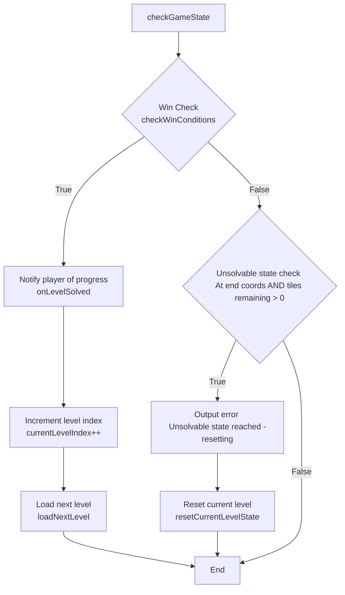

# COMP3016 CW1

Immersive Game Technologies

> This is an individual assignment to develop a 2D game in C++. <br>
> Implement a 2D game in C++ and upload to your git repository, then share the link in the readme. Your game needs to adhere to OOP concepts and additionally be able to load file content during execution. Do enough documented testing that it can be built and compile, and that it doesn’t crash upon unexpected input. Lastly, add in as many features as you can to make it story rich and/or fun!

[](https://wakatime.com/badge/user/55c30436-1509-4eb9-9f18-fa9b7c6060c4/project/0ae22791-78f9-4b74-a85d-f959b47d3de3)

| YouTube Game Demonstration and Code Walkthrough Link |
| :---: |
|  |
<!-- TODO -->

---

## Contents

1. [Gameplay Description](#gameplay-description)  
2. [Dependencies Used](#dependencies-used)  
3. [Use of AI Description](#use-of-ai-description)  
4. [Game Programming Patterns Used](#game-programming-patterns-used)  
5. [Game Mechanics and How They Are Coded](#game-mechanics-and-how-they-are-coded)  
6. [UML Design Diagrams](#uml-design-diagrams)  
7. [Sample Screens](#sample-screens)  
8. [Exception Handling and Test Cases](#exception-handling-and-test-cases)  
9. [Further Details](#further-details)  
10. [Project Evaluation](#project-evaluation)

## Gameplay Description

"Puzzle Path Game" is a tile based puzzle game where the player must use logic and reasoning skills to navigate a grid, visiting every walkable tile on their way.

The objective of the same is to move from the Start `S` tile to the End `E` tile, visiting every walkable tile on their route. If the user reaches the End `E` tile without first visiting every walkable tile, the level is considered to be in an unsolvable condition and the level is reset to it's initial state.

The game is inspired by B-Cubed on CoolMathsGames, an educational games platform. The game develops skills in younger players including logic, spatial reasoning and forward planning. The design of the game encourages players to reason through sequences and visualise the route in their minds before making a move.

The game features two main walkable tile types: Walkable `#` and Multi-Visit `2`, `1`. Whereas Walkable tiles may only be visited once, Multi-Visit tiles mist be visited multiple times before they are considered 'visited' by the game engine. This adds a layer of complexity and depth to the planning, where a tile will need to be revisited again later in the solution sequence. This complexity is introduced gradually in the Standard mode of the game, forcing the player to problem-solve and reason to understand the new mechanism.

There are two modes for gameplay, selectable in the Main Menu screen of the game.

Standard:
- Levels are played in a set sequential order as listed in the [level manifest file](./app/levels/level-manifest.txt), introducing complexity gradually.

Endless Random Mode:
- Levels are randomly shuffled each play-through cycle allowing for infinite replayability, with a running counter to track the progres of total levels completed across cycles.

## Dependencies Used

The project uses standard C++ libraries:
- `iostream`, `string`, `vector` Core utility.
- `fstream` File I/O for runtime level loading handling.
- `random`, `chrono`, `algorithm` Used by the `RandomGame` class to `std::shuffle` the level sequences, a time-based seed is used for randomisation.
- `memory` Used by `std::unique_ptr` to handle resource management for polymorphic `Game` and `RandomGame` objects, and dynamic safe memory allocation for `Grid` and `PlayerCursor` objects.

The game also depends on level files being present in `.txt` format in a `levels/` directory alongside the program's executable file at runtime. 

These files are copied using a Post-Build Event from `./app/levels/` to the output directory at build-time: `Debug/` or `Release/`.

`app` > `Properties` > `Build Events` > `Post-Build Event` > `Command Line`:

```sh
xcopy "$(ProjectDir)levels" "$(TargetDir)levels\" /s /i /y
```

> This command may be required to be changed if building the project on a non-Windows machine.

## Use of AI Description

## Game Programming Patterns Used

The system was developed using Object-Oriented Programming (OOP) principles, SOLID Software Engineering Design guidelines and Game Programming Patterns in mind, ensuring easy extensibility and maintainability for the project.

The project relies on polymorphism to decouple game logic from specific tile and game mode implementations, instead promoting extensibility and ahering to the Liskov Substituion Principle (LSP).

> "The Liskov substitution principle (LSP) states that functions that use pointers or references to base classes must be able to use objects of derived classes without knowing it."

This principle is in the Game Mode strategy and the Tile behaviour strategy.

### Gane Mode Strategy

The `runGameFlow()` function is used to run a game instance and provide error handling and reporting. It takes a parameter `std::unqiue_ptr<Game> gameInstance` to handle either the standard `Game` *or* the `RandomGame` object being passed in.

The game loop only ever calls the base class `Game::run(manifest)` method, but runtime behaviour of the game - whether using the Standard sequential loop, or the random endless shuffling - is determined by the extensions from the concrete derived class.

### Tile Behaviour Strategy

The `Tile` base class is publicly inherited from by the `StandardTile` and `MultiVisitTile` classes, with the derived classes extending or speciailising the functionality of the base classes methods.

The `Grid` class applies polymorphism by storing pointers to the base `Tile` class.

The `Tile` base class defines several `virtual` methods. `isWalkable()` and `updateStateOnExit()` are declared as pure virtual methods, forcing the derived classes to provide an implementation of their own for these methods.

```cpp
/**
* @brief Determine whether the Tile can be moved to.
* Overrides the pure virtual method Tile::isWalkable.
* @return True if the Tile permits movement, else false
*/
bool StandardTile::isWalkable() const {
	return (
		this->type == TileType::Walkable ||
		this->type == TileType::Start ||
		this->type == TileType::End
	);
}


/**
* @brief Determine whether the Tile can be moved to.
* Overrides the pure virtual method Tile::isWalkable.
* @return True if the Tile has remaining visits, else false
*/
bool MultiVisitTile::isWalkable() const {
	return this->remainingVisits > 0;
}
```

```cpp
/**
* @brief Update the Tile state when the player leaves it.
* Overrides the pure virtual method Tile::updateStateOnExit.
* @return True if the update succeeded, else false
*/
bool StandardTile::updateStateOnExit() {
	if (this->type == TileType::Walkable) {
		this->type = TileType::Visited;
		return true;
	}
	return false;
}


/**
* @brief Update the Tile state when the player leaves it.
* Overrides the pure virtual method Tile::updateStateOnExit.
* Decrements the number of remaining visits for the Tile if gt zero.
* @return True if the update succeeded (remainingVisits decremented), else false
*/
bool MultiVisitTile::updateStateOnExit() {
	if (this->remainingVisits > 0) {
		this->remainingVisits--;
		return true;
	}
	return false;
}
```

The `StandardTile` class uses the base `Tile::tileTypeToChar()` definition to handle conversion between the `TileType` enum and the display character outputted to the player's screen: `#`, `S`, `E`, `*`.

```cpp
// Tile.cpp

/** 
* @brief Converts a TileType value to its corresponding display character
* @return type The TileType object that is to be converted to a display character
* @params A character representing the given TileType
*/
char Tile::tileTypeToChar(TileType type) const {
	switch (type) {
		case TileType::Void:
			return ' ';
		case TileType::Walkable:
			return '#';
		case TileType::Start:
			return 'S';
		case TileType::End:
			return 'E';
		case TileType::Visited:
			return '*';
		case TileType::Invalid:
		default:
			return '?';
	}
}
```

This differs from the `MultiVisitTile` class which overrides this method to inject it's specialised logic and requirements based on it's own member variable states.

```cpp
// MultiVisitTile.cpp

/**
* @brief Converts a TileType value to its corresponding display character
* * Overrides the method Tile::tileTypeToChar.
* @return type The TileType object that is to be converted to a display character; should be TileType::MultiVisit
* @params A character representing the given TileType, depending on remainingVisits
*/
char MultiVisitTile::tileTypeToChar(TileType type) const {
	switch (this->remainingVisits) {
		case (2):
			return '2';
		case (1):
			return '1';
		case (0):
			return '*';
		default:
			return '+';
	}
}
```

### Template Method Pattern

The [Template Method Pattern](https://en.wikipedia.org/wiki/Template_method_pattern) ensures both game objects have a consistent lifecycle, whilst still allowing the derived class `RandomGame` to inject specialised functionality into the `Game` class, adhering to the Open/Closed Principle (OCP).

`Game::checkGameState()` provides a template that defines the required sequence of actions after a move is made by the user:

```cpp
/**
* @brief Checks the current game state and reacts to level completion or 
* unsolvable states
*/
void Game::checkGameState() {
	if (grid->checkWinConditions(player->getCurrentPosition())) {
		onLevelSolved();
		this->currentLevelIndex++;
		loadNextLevel();
		return;
	}

	if (player->getCurrentPosition() == grid->getEndCoords() &&
		grid->getRemainingWalkableTiles() > 0) {
		std::cerr << "Unsolvable state reached! Resetting..." << std::endl;
		this->resetCurrentLevelState();
	}
}
```



The `virtual` method `Game::onLevelSolved()` acts as a hook, allowing the `RandomGame` class to inject logic. The base implementation prints a standard "Level Solved!" message to the player. The `RandomGame` class overrides the hook to implement its specialised logic: it increments the `totalLevelsCompleted` counter variable and outputs the "Level Solved!" message alongside a message informing the user on how many levels they have completed in this play of the Random Endless Mode.

```cpp
// Game.cpp

/**
* @brief Default hook method that prints a message when a level has been successfully solved.
*/
void Game::onLevelSolved() {
	std::cout << "\nLevel " << this->currentLevelIndex + 1 << " solved!\n" << std::endl;
}
```

```cpp
/**
* @brief Overriden method that increments total levels completed counter and
* outputs number of levels solved.
*/
void RandomGame::onLevelSolved() {
	this->levelsCompleted++;

	std::cout << "\nLevel " << this->currentLevelIndex + 1 << " solved!" << std::endl;
	std::cout << "(Total Completed: " << this->levelsCompleted << ")\n" << std::endl;
}
```

This injection extends the functionality without requiring any modification to handle conditional flows within the `Game::checkGameState()` method.

### Resource Acquisition Is Initialisation (RAII) Pattern

The project uses the [Resource Acquisition Is Initialisation](https://en.wikipedia.org/wiki/Resource_acquisition_is_initialization) Pattern via `std::unique_ptr` to provide safe resource management.

The `Game` class uses `std::unique_ptr` to acquire its dynamically allocated component, `Grid` and `PlayerCursor`, guaranteeing that memory is released automatically when the owning smart point (Grid) is destroyed or reset. This provides memory safety by eliminating the risk of a memory leak.

The RAII Pattern is also used within the `runGameFlow` function. If a `LevelLoadException` occurs during level initialisation then the `unique_ptr` managing the `Game` (or `RandomGame`) instance automatically cleans its owned pointers and memory before returning to the Main Menu.

### Game Loop Pattern

Finally, the Game Loop Pattern is what controls the flow of the game. Game Loop logic is encapsulated within the `Game::run()` method.

1. Render the current `Grid` and `PlayerCursor` state to the terminal
2. Read and handle the user's movement input 
3. Check the current game state for win/fail conditions
4. Repeat.

As the Game Loop is encapsulated within `Game::run()`, the game logic is decoupled away from the menu screen in `app.cpp`

## Game Mechanics and How They Are Coded

### Level Loading

Level Loading is handled by the `LevelLoader` class. This class is implemented as a static utility class with a deleted private constructor to block instantiation.

```cpp
class LevelLoader {
private:
	LevelLoader() = delete;
	static TileType charToTileType(char c);
public:
	static std::vector<std::vector<TileType>> loadLevel(const std::string& filename);
};
```

The `LevelLoader::loadLevel` method opens the level file before iterating over each character present in the file and translates the data into a level blueprint (`std::vector<std::vector<TileType>>`).

A custom `LevelLoadException` was defined alongside the `LevelLoader` class in `LevelLoader.h`, inheriting from `std::runtime_error`. 

This exception is thrown if:
1. The file cannot be opened
2. File contains invalid characters that can't be parsed
3. File line have inconsistent lengths

These exceptions get bubbled up to the `Game::loadNextLevel` method, which then attempts to skip the current level load and load the next level.

The design of this class enforces the [Single Responsibility Principle](https://en.wikipedia.org/wiki/Single-responsibility_principle) (SRP), seperating the concern of File I/O and level parsing out of the `Game` classes area of concern of managing the flow and state of the game.

<!-- TODO -->

## UML Design Diagrams

## Sample Screens

## Exception Handling and Test Cases

```txt
PS C:\Users\richa\Desktop\comp3016-cw1\app\x64\Debug> ./app --test
Running in Test Mode.
Loading files from: levels/test-manifest.txt

Loading: tests/test-missing-start.txt
Error Loading Level tests/test-missing-start.txt: Level Load Error: Level failed to initialise: Missing either Start or End tile (Sentinel value check).

Loading: tests/test-missing-end.txt
Error Loading Level tests/test-missing-end.txt: Level Load Error: Level failed to initialise: Missing either Start or End tile (Sentinel value check).

Loading: tests/test-empty.txt
Error Loading Level tests/test-empty.txt: Level Load Error: File contained no level setup data.

Loading: tests/test-invalid-character.txt
Error Loading Level tests/test-invalid-character.txt: Level Load Error: Failed to parse character '! into a Tile.

Loading: tests/test-shape-error.txt
Error Loading Level tests/test-shape-error.txt: Level Load Error: Inconsistent line length in level file tests/test-shape-error.txt

Loading: tests/test-doesnt-exist.txt
Error Loading Level tests/test-doesnt-exist.txt: Level Load Error: Failed to open level file: tests/test-doesnt-exist.txt

Loading: tests/test-skips-to-working.txt
Loaded Level 7
Visit all 3 tiles to pass the level!

P # E

Move (WASD): d

S P E

Move (WASD): d
Level 7 solved!


Loading: tests/test-trailing-newline.txt
Loaded Level 8
Visit all 3 tiles to pass the level!

P # E

Move (WASD): dd

S P E

Move (WASD): Level 8 solved!
```

## Further Details

## Project Evaluation

